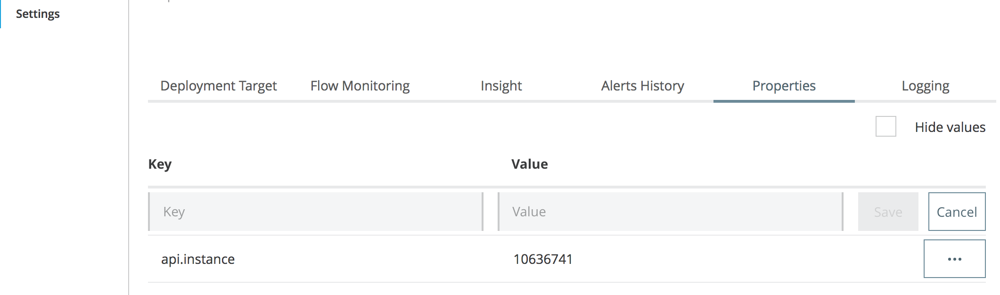
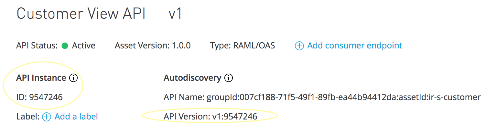

# Documentation 

Use this script to easily promote your APIs and applications from one environment to the other. The script execution is fully configurable, so it can support all the environments and promote APIs and applications in any direction. 

The tool also solves the problem stated below:<p>
**How to make application aware of the new API Version for auto-discovery purposes without the need to update application itself and build a new package.**

Project also contains prebuild Jenkins pipeline for "one click" deployment to provide some idea on how this tool could be used in terms of CICD.

## Prerequisite

* Installed Node.js
* Set environment variables:
	* `ANYPOINT_USER` - user with permission to promote APIs (deployment user)
	* `ANYPOINT_PASSWORD` - user password

## Supported Anypoint Platform versions

* Crowd 2
* API: [ARM - Anypoint Runtime Manager 1.23](https://anypoint.mulesoft.com/apiplatform/anypoint-platform/#/portals/organizations/ae639f94-da46-42bc-9d51-180ec25cf994/apis/38784/versions/1490649/pages/182845)
* API: [API Manager v1](https://anypoint.mulesoft.com/exchange/portals/anypoint-platform-eng/f1e97bc6-315a-4490-82a7-23abe036327a.anypoint-platform/api-manager-api/api/v1/pages/Promoting%20an%20API/)
* Tested on Mule Runtime 3.9.0


## Configuration
<details><summary><b>Sample Config File</b></summary><p>
	
```
Config:
  SourceEnvName: "TEST"				//name of environment configure on ARM
  SourceServerName: "ContainerizedCluster"	//source runtime name - could be server or cluster
  SourceServerType: "CLUSTER"			//supported types are SERVER or CLUSTER
  TargetEnvName: "PROD"				//name of environment configured on ARM
  TargetServerName: "joker"			//target runtime name - could be server or cluster
  TargetServerType: "SERVER"			//supported types are SERVER or CLUSTER
  Applications:					//all the applications running on source runtime that should be promoted to target runtime
    - 
      appName: "ir-s-customer"			//application name as displayed on the source server
      apiInstanceId: 9546857			//API Instance ID application is registered with
```
</p></details>

## How to run
1. Update configuration file as per your requirements
```
config/promotion_config.yml
```
2. Use npm to install project dependencies
```
npm install
```
3. Run script app.js to:
	1. Pormote API Instances and applications
	```
	node src/app.js
	```
	2. Promote Applications only - patch applications without any updates in registration with API Manager 
	```
	node src/app.js app-only
	```

## APIs and Applications promotion and auto-discovery
Chapter describes how to enable auto-discovery for APIs and applications that have been promoted.

Auto-discovery requires API Version to be configured within the application `<api-platform-gw:api apiName="${api.name}" version="${api.build.version}:${api.instance}" flowRef="api-main" create="true" apikitRef="api-config" doc:name="API Autodiscovery" />`. See documentation for more details [here](https://docs.mulesoft.com/api-manager/v/2.x/configure-auto-discovery-new-task). The API Version is generated as part of the API promotion process (once API Instance is created on specific environment), however application must be aware of the API Version in API Manager to register with API Manager.

The problem statement the solution solves is: **How to make application aware of the new API Version for auto-discovery purposes without the need to update application itself and build a new package.** - so an application can be easily promoted instead of doing standard deployment / redeployment.

### Restrictions
The tool has been tested for Mule runtime 3.9.0. Please note, that there are some deviations from Mule runtime 4 auto-discovery configuration. More details could be found [here](https://docs.mulesoft.com/api-manager/v/2.x/api-auto-discovery-new-concept).

The tool doesn't support application promotion only, if it is a fresh deployment (target server is not running the application yet) without API promotion and registration.

Supported scenarios are:
* Promote API together with application (fresh deployment).
* Promote API Instance (the original one won't be used anymore - will be switched to Inactive state) and patch existing application on target server.
* Patch existing application on the target servers - no updates in API Instance / new application version will register with the same API Instance as the old version.

### Capturing API Version
How to capture API Version and make it available for application.

After running the command `node src/app.js` API Instances are promoted and API Instance IDs captured, so each application can be registered with proper API Instance as part of the next step: promotion of applications. The script creates a pairs of origin API Instance ID and newly generated API Instance ID (ID of promoted API Instance on the target environment), so it can easily identify what application needs to use what API Instance ID.

Captured API Instance ID is then used and added to properties in application's settings, as displayed on picture below: 


### Project configuration
How to configure the project / application to use a new API Instance ID generated by promoting the instance from lower environment.

**1. Step**: Configure auto-discovery

<details><summary><b>Sample</b></summary>
	
```xml
<api-platform-gw:api apiName="${api.name}" version="${api.build.version}:${api.instance}" flowRef="api-main" create="true" apikitRef="api-config" doc:name="API Autodiscovery" />
```
</details><p></p>

**2. Step**: Configure Maven to enable filtering of application directory. Add the following to your `pom.xml` for plugin `mule-app-maven-plugin`: `<copyToAppsDirectory>true</copyToAppsDirectory>`.

<details><summary><b>Sample - Maven plugin</b></summary>
	
```xml
<plugin>
  <groupId>org.mule.tools.maven</groupId>
  <artifactId>mule-app-maven-plugin</artifactId>
  <version>${mule.tools.version}</version>
  <extensions>true</extensions>
  <configuration>
    <copyToAppsDirectory>true</copyToAppsDirectory>
    <filterAppDirectory>true</filterAppDirectory>
  </configuration>
</plugin> 
```
</details><p></p>

Also, add a new Maven property `<api.build.version>v1</api.build.version>`. The value must match the API Specification version in RAML (and in Exchange / API Manager).

<details><summary><b>Sample - Maven property</b></summary>
	
```xml
  <properties>
    <api.build.version>v1</api.build.version>
    
    <project.build.sourceEncoding>UTF-8</project.build.sourceEncoding>
    <project.reporting.outputEncoding>UTF-8</project.reporting.outputEncoding>
    <mule.version>3.9.0</mule.version>
    <mule.tools.version>1.2</mule.tools.version>
    <maven.assembly.plugin.version>3.0.0</maven.assembly.plugin.version>
    <maven.release.plugin.version>2.5.3</maven.release.plugin.version>
    <munit.version>1.3.7</munit.version>
    <mule.munit.support.version>3.9.1</mule.munit.support.version>
  </properties>
```
</details><p></p>

How does the configuration described above work? <p></p>
Maven uses property `<api.build.version>v1</api.build.version>` to filter application folder, which replaces variables in configuration of auto-discovery: `version="${api.build.version}:${api.instance}"`. For this specific example we would get: `version="v1:${api.instance}"`. Property from settings `api.instance` is then used during the application deployment / start up to replacy variable `${api.instance}`, so finally we are getting `version="v1:9547246` and auto-discovery is enabled (for Mule 4 the API Instance ID is used instead of full api version, however it is NOT currently supported by the script).

## Continues Deployment
Project also contains `Jenkinsfile` with simple pipeline definition for easy integration with Jenkins. Pipeline implements "one click" deployment and is configured to be triggered manually.
The same environment variables as mentioned in [**Prerequisite**](#prerequisite) section must be configured on Jenkins server.

#### Pipeline consists of the following steps:

**1. Step**:  Promote APIs and Application: runs command `node src/app.js`

Step could be also reconfigured to promote applications only by updating the command above to: `node src/app.js app-only`.

## Roadmap

* API Manager: Promoting an API - IMPLEMENTED
* Promote to more than one target in parallel
* Cloudhub support
* Mule 4 support

## Not Supported Functionality
Deployment of external properties file is not supported. Properties file must be copied to server before this script runs.

Every API Instance promotion would create a new API Instance on target environment. Patching of API Instance is not supported.

## Notes
* Custom policies are supported. The tool will promote API Instance with all the configured policies, custom policies included.

* New API Instance creation means that your client applications must request access for this new version (e.g. if Client ID enforcement policy has been applied).

* Impact on Analytics yet to be clarified.

* Difference between **API Instance ID** and **API Version** can be seen in API Manager as highlighted on the picture below:

